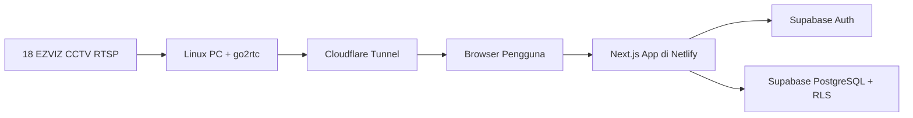

# Design - Live CCTV Web Portal Sekolah

## 1. Arsitektur Sistem

Sistem menggunakan arsitektur hybrid. Komponen streaming berada di jaringan lokal sekolah, sedangkan portal web dan database berada di cloud.



Prinsip penting:

- Video tidak disimpan di cloud portal.
- Browser mengambil stream langsung dari endpoint tunnel go2rtc.
- Portal web hanya mengelola UI, autentikasi, metadata, permission, dan log.

## 2. Tech Stack

| Layer | Teknologi |
|---|---|
| Frontend | Next.js App Router |
| UI | React, Tailwind CSS, shadcn/ui opsional |
| Auth | Supabase Auth |
| Database | Supabase PostgreSQL |
| Authorization | Supabase RLS + Next.js Middleware |
| Hosting | Netlify |
| Streaming | go2rtc |
| Tunnel | Cloudflare Tunnel |

## 3. Modul Aplikasi

### 3.1 Auth Module

Tanggung jawab:

- Login.
- Logout.
- Membaca session Supabase.
- Membaca role dari `profiles`.
- Redirect berdasarkan role.
- Proteksi route via middleware.

Role yang valid:

```text
admin
principal
parent
```

### 3.2 Admin Module

Route:

```text
/admin
/admin/users
/admin/classes
/admin/cameras
/admin/mapping
/admin/monitoring
/admin/logs
```

Komponen utama:

- Admin dashboard.
- User table.
- User form.
- Class table.
- Camera table.
- Mapping class-camera.
- Mapping user-class.
- Snapshot monitoring grid.
- Activity log table.

### 3.3 Principal Module

Route:

```text
/principal
/principal/classes
/principal/classes/[classId]
```

Komponen utama:

- Principal dashboard.
- Class list.
- Class camera live view.

Hak akses:

- Bisa melihat semua kelas.
- Bisa melihat kamera semua kelas.
- Tidak bisa mengelola data admin.

### 3.4 Parent Module

Route:

```text
/parent
/parent/cameras
/parent/classes/[classId]
```

Komponen utama:

- Parent dashboard.
- Allowed camera list.
- Live player.

Hak akses:

- Hanya melihat kelas yang ada pada `user_classes`.
- Hanya melihat kamera yang terhubung ke kelas tersebut melalui `class_cameras`.

## 4. Desain Database

### 4.1 Enum Role

```sql
create type public.user_role as enum ('admin', 'principal', 'parent');
```

### 4.2 Profiles

```sql
create table public.profiles (
  id uuid primary key references auth.users(id) on delete cascade,
  nama text not null,
  role public.user_role not null default 'parent',
  created_at timestamptz not null default now(),
  updated_at timestamptz not null default now()
);
```

### 4.3 Classes

```sql
create table public.classes (
  id uuid primary key default gen_random_uuid(),
  nama_kelas text not null unique,
  created_at timestamptz not null default now(),
  updated_at timestamptz not null default now()
);
```

### 4.4 Cameras

```sql
create table public.cameras (
  id uuid primary key default gen_random_uuid(),
  nama_kamera text not null,
  source_name text not null unique,
  tunnel_url text not null,
  snapshot_url text,
  deskripsi text,
  is_active boolean not null default true,
  created_at timestamptz not null default now(),
  updated_at timestamptz not null default now()
);
```

Catatan:

- `source_name` adalah nama stream pada konfigurasi go2rtc.
- `tunnel_url` adalah URL live player atau endpoint stream.
- `snapshot_url` dapat disimpan eksplisit, atau dibuat dari base URL tunnel dan `source_name`.

### 4.5 Class Cameras

```sql
create table public.class_cameras (
  class_id uuid not null references public.classes(id) on delete cascade,
  camera_id uuid not null references public.cameras(id) on delete cascade,
  created_at timestamptz not null default now(),
  primary key (class_id, camera_id)
);
```

### 4.6 User Classes

```sql
create table public.user_classes (
  user_id uuid not null references public.profiles(id) on delete cascade,
  class_id uuid not null references public.classes(id) on delete cascade,
  created_at timestamptz not null default now(),
  primary key (user_id, class_id)
);
```

### 4.7 Activity Logs

```sql
create table public.activity_logs (
  id uuid primary key default gen_random_uuid(),
  user_id uuid references public.profiles(id) on delete set null,
  action text not null,
  camera_id uuid references public.cameras(id) on delete set null,
  metadata jsonb not null default '{}'::jsonb,
  created_at timestamptz not null default now()
);
```

## 5. Helper Function RLS

Gunakan helper agar policy lebih rapi.

```sql
create or replace function public.current_user_role()
returns public.user_role
language sql
security definer
set search_path = public
stable
as $$
  select role from public.profiles where id = auth.uid()
$$;

create or replace function public.is_admin()
returns boolean
language sql
security definer
set search_path = public
stable
as $$
  select public.current_user_role() = 'admin'
$$;

create or replace function public.is_principal()
returns boolean
language sql
security definer
set search_path = public
stable
as $$
  select public.current_user_role() = 'principal'
$$;
```

## 6. RLS Policy Draft

Aktifkan RLS:

```sql
alter table public.profiles enable row level security;
alter table public.classes enable row level security;
alter table public.cameras enable row level security;
alter table public.class_cameras enable row level security;
alter table public.user_classes enable row level security;
alter table public.activity_logs enable row level security;
```

### 6.1 Profiles

```sql
create policy "Users can read own profile"
on public.profiles for select
using (id = auth.uid());

create policy "Admins can read all profiles"
on public.profiles for select
using (public.is_admin());

create policy "Admins can manage profiles"
on public.profiles for all
using (public.is_admin())
with check (public.is_admin());
```

### 6.2 Classes

```sql
create policy "Admins and principals can read all classes"
on public.classes for select
using (public.is_admin() or public.is_principal());

create policy "Parents can read assigned classes"
on public.classes for select
using (
  exists (
    select 1 from public.user_classes uc
    where uc.class_id = classes.id
    and uc.user_id = auth.uid()
  )
);

create policy "Admins can manage classes"
on public.classes for all
using (public.is_admin())
with check (public.is_admin());
```

### 6.3 Cameras

```sql
create policy "Admins and principals can read all cameras"
on public.cameras for select
using (public.is_admin() or public.is_principal());

create policy "Parents can read cameras assigned to their classes"
on public.cameras for select
using (
  exists (
    select 1
    from public.user_classes uc
    join public.class_cameras cc on cc.class_id = uc.class_id
    where uc.user_id = auth.uid()
    and cc.camera_id = cameras.id
  )
);

create policy "Admins can manage cameras"
on public.cameras for all
using (public.is_admin())
with check (public.is_admin());
```

### 6.4 Junction Tables

```sql
create policy "Admins and principals can read class camera mappings"
on public.class_cameras for select
using (public.is_admin() or public.is_principal());

create policy "Parents can read class camera mappings for assigned classes"
on public.class_cameras for select
using (
  exists (
    select 1 from public.user_classes uc
    where uc.user_id = auth.uid()
    and uc.class_id = class_cameras.class_id
  )
);

create policy "Admins can manage class camera mappings"
on public.class_cameras for all
using (public.is_admin())
with check (public.is_admin());

create policy "Users can read own class mappings"
on public.user_classes for select
using (user_id = auth.uid());

create policy "Admins and principals can read user class mappings"
on public.user_classes for select
using (public.is_admin() or public.is_principal());

create policy "Admins can manage user class mappings"
on public.user_classes for all
using (public.is_admin())
with check (public.is_admin());
```

### 6.5 Activity Logs

```sql
create policy "Admins can read all logs"
on public.activity_logs for select
using (public.is_admin());

create policy "Users can insert own logs"
on public.activity_logs for insert
with check (user_id = auth.uid());

create policy "Admins can insert logs"
on public.activity_logs for insert
with check (public.is_admin());
```

## 7. Next.js Struktur Folder

```text
app/
  (auth)/
    login/
      page.tsx
  unauthorized/
    page.tsx
  admin/
    layout.tsx
    page.tsx
    users/
      page.tsx
    classes/
      page.tsx
    cameras/
      page.tsx
    mapping/
      page.tsx
    monitoring/
      page.tsx
    logs/
      page.tsx
  principal/
    layout.tsx
    page.tsx
    classes/
      page.tsx
      [classId]/
        page.tsx
  parent/
    layout.tsx
    page.tsx
    cameras/
      page.tsx
    classes/
      [classId]/
        page.tsx
components/
  auth/
  dashboard/
  cameras/
  classes/
  admin/
lib/
  supabase/
    client.ts
    server.ts
    admin.ts
  auth/
    roles.ts
    guards.ts
  go2rtc/
    urls.ts
  logs/
    activity.ts
middleware.ts
```

## 8. Middleware RBAC

Prinsip:

- Middleware membaca session user.
- Middleware mengambil role dari profile atau custom claim.
- Route dilindungi berdasarkan prefix.

Draft rule:

```text
/admin/*      -> admin only
/principal/*  -> principal, admin optional jika ingin debug
/parent/*     -> parent only
```

Rekomendasi:

- Simpan role di `profiles`.
- Untuk performa lebih baik, role bisa disalin ke custom JWT claims melalui Supabase hook atau server-side sync.
- Jika belum memakai custom claims, middleware dapat memanggil Supabase server client untuk membaca profile.

## 9. Desain Stream dan Snapshot

### 9.1 Live Stream

Setiap kamera memiliki `source_name` sesuai konfigurasi go2rtc.

Contoh URL:

```text
https://cctv-sekolah.example.com/stream.html?src=kelas-1-a
https://cctv-sekolah.example.com/api/ws?src=kelas-1-a
https://cctv-sekolah.example.com/api/stream.m3u8?src=kelas-1-a
```

Pilih strategi player:

1. WebRTC sebagai mode utama untuk latency rendah.
2. HLS sebagai fallback jika WebRTC gagal.

### 9.2 Snapshot Admin

Endpoint snapshot:

```text
https://cctv-sekolah.example.com/api/frame.jpeg?src=kelas-1-a
```

UI snapshot:

- Grid responsif.
- Tiap tile menampilkan nama kamera.
- Auto refresh dengan query cache buster:

```text
?src=kelas-1-a&t=1710000000000
```

- Interval default: 10 detik.
- Jangan refresh semua frame pada waktu persis sama jika koneksi lemah. Bisa gunakan stagger delay.

## 10. UI Design

### 10.1 Prinsip UI

- Desain sederhana, operasional, dan mudah dipindai.
- Sidebar untuk dashboard role.
- Tabel untuk data admin.
- Grid kamera untuk monitoring.
- Status online/offline terlihat jelas.
- Hindari tampilan marketing atau landing page.

### 10.2 Layout Admin

Admin layout:

- Sidebar:
  - Dashboard
  - Users
  - Classes
  - Cameras
  - Mapping
  - Monitoring
  - Logs
- Topbar:
  - Nama user
  - Role
  - Logout
- Main content:
  - Card ringkasan
  - Tabel dan form

### 10.3 Layout Principal

- Sidebar sederhana:
  - Dashboard
  - Classes
- Halaman class detail menampilkan semua kamera kelas dalam grid live player.

### 10.4 Layout Parent

- Dashboard welcome.
- Daftar kelas anak.
- Daftar kamera yang diizinkan.
- Tombol buka live view.

## 11. Environment Variables

```env
NEXT_PUBLIC_SUPABASE_URL=
NEXT_PUBLIC_SUPABASE_ANON_KEY=
SUPABASE_SERVICE_ROLE_KEY=
NEXT_PUBLIC_GO2RTC_PUBLIC_BASE_URL=
GO2RTC_INTERNAL_BASE_URL=
ACTIVITY_LOG_ENABLED=true
```

Catatan:

- `NEXT_PUBLIC_*` boleh dibaca browser.
- `SUPABASE_SERVICE_ROLE_KEY` hanya server-side.
- `GO2RTC_INTERNAL_BASE_URL` opsional jika server perlu melakukan health check.

## 12. Logging Design

Function:

```text
logActivity(userId, action, cameraId?, metadata?)
```

Action yang disarankan:

```text
auth.login
auth.logout
camera.view_live
camera.view_snapshot
class.open
admin.user.create
admin.user.update
admin.camera.create
admin.camera.update
admin.mapping.update
```

Untuk akses kamera, log dilakukan saat user membuka halaman player atau saat player mulai dimuat.

## 13. Testing Strategy

### 13.1 Unit Test

- Helper role.
- URL builder go2rtc.
- Activity logger.

### 13.2 Integration Test

- Query kamera parent hanya mengembalikan kamera kelasnya.
- Admin bisa melihat semua kamera.
- Principal bisa melihat semua kelas.

### 13.3 Manual Test

- Login admin, principal, parent.
- Coba akses route role lain.
- Coba parent membuka URL class lain.
- Cek RLS dari Supabase SQL editor dengan impersonasi JWT atau user test.
- Matikan tunnel, pastikan UI error tidak crash.

